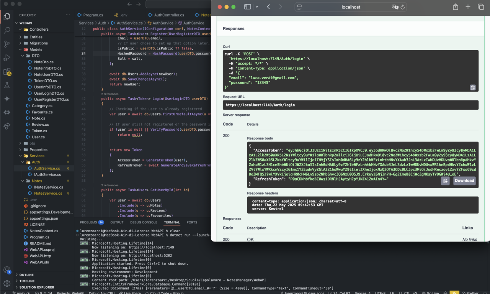

# NotesManager - WebAPI

 

> WebAPI built with <a href="#">ASP.NET</a> that handles requests from an hypothetical WebAPP as a NotesManager, to a local database managed with MariaDB. 




## 📋 List of Content 
- [Packages](#-packages)
- [Features](#-features)
- [SetUp](#setup)
- [Usage](#usage)
- [License](#-license)

## 📦 Packages

| Name | Version |
| --- | --- |
| DotNetEnv | 3.1.1 |
| Microsoft.AspNetCore.Authentication.JwtBearer | 8.0.0 |
| Microsoft.AspNetCore.OpenApi | 8.0.11 |
| Microsoft.EntityFrameworkCore.Design | 8.0.0 |
| Pomelo.EntityFrameworkCore.MySql | 8.0.3 |
| Swashbuckle.AspNetCore | 6.6.2 |

## 🚀 Features 

### Repository pattern
Implements the Repository Pattern to ensure separation of the business logic, testability and code reusability

### .env File
This file has to contain your local database connection info, password hashing parameters, and JWT configuration. It is not visible in the project because it is listed in <i>.gitignore</i>. The file has to follow that format using those properties names: 
```
ConnectionStrings__DefaultConnection=""
Pw__Pepper=""
PwHash__Iterations=""
JWT__Key=""
JWT__Issuer=""
JWT__Audience""
```
Those environment variables will be loaded by the "DotNetEnv" library in the <i>Program.cs</i> 

### Auth with JWT (refresh-token support)
People can decide to register creating a new account or navigating as guests. But there are some differences between the action those people are authorized to do.

<b>Users Authorizations</b><br>
They can create new notes, choose if make them public or private.
Each note can be associated with a category
The user can also see and modify informations about his profile and consulting his notes. 
Moreover he can view all the public notes filtering them by categories. 
It’s also possible write reviews attaching them to public notes. 

<b>Guests Authorization</b><br>
They can only visualize notes published by users.

> The access and refresh token are generated and associated to the user just logged in. So the authorization of receveing the result of the call of an endpoint is determined by the fact of having a valid access token or not. 

<b>Refresh Token Usage</b><br>
The refresh token is generated for the first time with the access token. It's the only one that will be saved in the database in relation of the user who owns it, with its ExpiryDate. That refresh-token used to extend the session duration. To protect user data, the access token has a shorter time of usage than the refresh-token. Once the access token expired and the user make a request for an endpoint that need the Authorization, if the access token is not valid and the client detect a <i>401 Unauthorized</i> (that can also mean that is expired), the client can call the "/refresh-token" endpoint. This one checks for refresh token validation, and if its valid it will generates a new access token and refresh token, but not changing the refresh token ExpiryDate. Once the refresh token expired, the user needs to log in again to receive a new pair of tokens. 


### Hashing passwords with salting and peppering
In the HashedPassword field will be saved the digest of the hash function of the plain text inserted by the user. The HashAlgorithm is "SHA256", that is given, as a parameter, to the C# function Rfc2898DeriveBytes. That functions accepts as parameters: the password plain text (in that case the pepperdPassword), the salt, the iterations, and the HashAlgorithName. The HashAlgorith will be applied to the password plain text N times, Number definded by the "iterations" parameter. 

<a name="setup"></a>
## ⚙️ SetUp
### 1. Clone the repo
```sh
git clone https://github.com/Lore-Arci/NotesManager-WebAPI.git
cd NotesManager-WebAPI
```

### 2.  Create the .env File
```
ConnectionStrings__DefaultConnection="server="";port="";database="";user="";password="";
Pw__Pepper="PepperString"
PwHash__Iterations="NIterations"
JWT__Key="JwtSimmetricKey"
JWT__Issuer="NotesManagerAPI"
JWT__Audience="NotesManagerUsers"
```

### 3. Restore dependencies
``` sh
dotnet restore
```

### Update the Database
``` sh
dotnet ef database update
```

### 4. Run the WebAPI
```C#
// Running with the default profile
dotnet run
// Running in https
dotnet run --launch-profile "https"
```

### 5. Access to the WebAPI
This WebAPI uses Swagger (OpenAPI) for testing endpoints. Once the API is running, access the Swagger UI by navigating to:
```
http://localhost:5202/swagger
https://localhost:7149/swagger
```
<a name="usage"></a>
## 🛠️ Usage
This is an open source project under the MIT license. You are free to: 
- Clone or fork it
- Customize your <i>env</i> file
- Extend or modify it for your own use

## 📜 License

This software is licensed under the [MIT](https://github.com/nhn/tui.editor/blob/master/LICENSE) 


